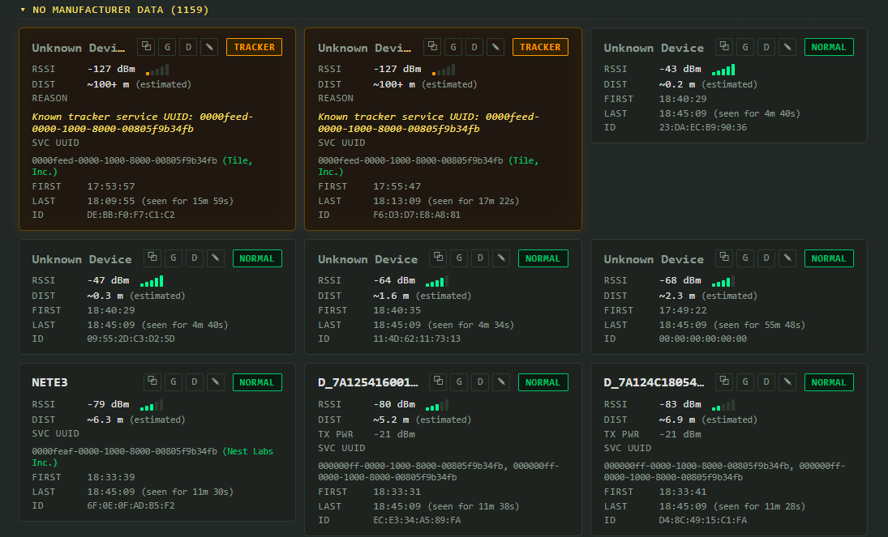

# TODO / Roadmap version 2

1) The following device is shown as a normal device instead of a surveillance device:
PLAUD_NOTE | ID: CF:A1:AB:53:8D:92 | MFR: 0x0059 (Nordic Semiconductor ASA) | RSSI: -87 dBm
We need to map more devices correctly.

2) When selecting GROUP BY MFR, the SORT does not work anymore.
It should sort the MFR with the highest severity above the others.

3) Allow export to .csv
One "export all MFR" with the amount.
One "export full" with all devices and their information.

4) We see devices with complete SVC UUID such as
NETE3 | ID: 6F:0E:0F:AD:B5:F2 | RSSI: -79 dBm
SVC UUID 0000feaf-0000-1000-8000-00805f9b34fb (Nest Labs Inc.)
but underneath ▾ NO MANUFACTURER DATA (1159)

This as well:
Unknown Device
TRACKER
RSSI
-127 dBm 
DIST
~100+ m (estimated)
REASON
Known tracker service UUID: 0000feed-0000-1000-8000-00805f9b34fb
SVC UUID
0000feed-0000-1000-8000-00805f9b34fb (Tile, Inc.)

See 

In case these are unknown devices, we will create a new .js file with devices we have found.
In case these are already known, fix the code so these are shown correctly.

5) incase the Add Device buttons seems useless, remove the button.

---

## Implementation plan

### 1) Curated device database for false negatives (e.g. PLAUD_NOTE)

Root cause: `PLAUD_NOTE` only advertises MFR ID `0x0059` (Nordic Semiconductor), a
generic BLE chipset vendor used by thousands of unrelated products. It can never be
added to `TRACKER_COMPANIES` / `SURVEILLANCE_COMPANIES` — that would flag nearly
every cheap BLE gadget as a threat. It must be recognized by device **name** instead.

Steps:
- [ ] Create `media/known-devices.js`, loaded as a classic `<script>` in
      [index.html](index.html) right after `company_identifiers.js` and before `script.js`.
- [ ] In it, define `KNOWN_DEVICE_NAME_PATTERNS` — an array of
      `{ pattern: RegExp, type: 'surveillance'|'tracker', reason: string }` entries for
      real-world devices we've identified by name/model that generic MFR-ID or
      built-in name-pattern rules miss (silicon-vendor-only BLE chips: Nordic,
      Espressif, Dialog/Renesas, ST, TI, etc. must never be classified by MFR ID alone).
- [ ] First entry: `{ pattern: /plaud/i, type: 'surveillance', reason: 'PLAUD Note — wearable AI voice recorder' }`.
- [ ] In [media/script.js](media/script.js), extend `classifyAdvertisement()`'s existing
      name-pattern step (around `SURVEILLANCE_NAME_PATTERNS`/`TRACKER_NAME_PATTERNS`,
      ~line 250) to also loop `KNOWN_DEVICE_NAME_PATTERNS` (guard with
      `typeof KNOWN_DEVICE_NAME_PATTERNS !== 'undefined'` the same way `SERVICE_UUID_NAMES`
      is guarded), returning `{ type, reason }` from the matched entry.
- [ ] Document in a comment why MFR ID alone is unsafe for generic silicon vendors,
      so future contributors add new findings to `known-devices.js` by name pattern,
      not by MFR ID.
- [ ] Test: reload, confirm `PLAUD_NOTE` (and any bench-testable device) now shows the
      `SURVEILLANCE` badge with the correct reason text.

### 2) Fix group order when GROUP BY MFR + SORT are combined

Root cause: `renderDeviceList()` (~line 501) always does
`for (const key of [...groups.keys()].sort())` — plain alphabetical order — ignoring
`sortMode` entirely. Only the devices *inside* each group respect `deviceComparator`.

Steps:
- [ ] Add a helper `groupSortValue(items)` in [media/script.js](media/script.js) near
      `SEVERITY_RANK`/`deviceComparator` that returns the group's worst-case severity
      (`Math.max(...items.map(d => SEVERITY_RANK[d.classification.type] ?? 0))`) plus a
      secondary value depending on `sortMode`: best RSSI for `proximity`, most recent
      `lastSeen` for `lastseen`/default, group key text for `name`.
- [ ] Replace the alphabetical `.sort()` in `renderDeviceList()`'s `groupByMfr` branch
      with a comparator that sorts by severity (desc) first, then the secondary value,
      so manufacturer groups containing a SURVEILLANCE/TRACKER device always float to
      the top regardless of the selected SORT mode.
- [ ] Keep the existing per-item `items.sort(deviceComparator)` inside each group as-is.
- [ ] Test matrix: toggle GROUP BY MFR × each SORT option (LAST SEEN, PROXIMITY,
      SEVERITY, NAME) and confirm group ordering changes sensibly and threat groups
      stay on top in all four modes.

### 3) CSV export (manufacturer summary + full device dump)

Steps:
- [ ] Add two buttons to the Controls bar in [index.html](index.html), next to
      `btn-clear`: `id="btn-export-mfr"` `[ EXPORT MFR CSV ]` and
      `id="btn-export-full"` `[ EXPORT FULL CSV ]`.
- [ ] In [media/script.js](media/script.js) add a shared `downloadCsv(filename, rows)`
      helper: build CSV text (rows = array of arrays), quote every field, double up
      embedded quotes, and **prefix any field starting with `=`, `+`, `-`, or `@` with
      a leading `'`** — device names are attacker-controlled BLE broadcast data, so this
      prevents CSV/Excel formula-injection when the export is opened in a spreadsheet.
      Build a `Blob` (`text/csv;charset=utf-8;`), create an object URL, click a
      temporary `<a download>`, then revoke the URL.
- [ ] Add `exportMfrSummaryCsv()`: group current `devices` via `groupKeyFor()`, output
      columns `Manufacturer ID/Group, Total, Surveillance, Trackers, Normal`.
- [ ] Add `exportFullCsv()`: one row per device with columns `ID, Name, Classification,
      Reason, Manufacturer IDs, Manufacturer Names, Service UUIDs, RSSI, Est. Distance (m),
      TX Power, First Seen (ISO), Last Seen (ISO), Note`.
- [ ] Wire click listeners in the init block near the other button bindings; disable
      both buttons (or show a notice) when `devices.size === 0`.
- [ ] Test: scan/add a few devices, export both files, open in a spreadsheet app and
      verify columns/encoding, and verify a crafted device name containing `=1+1` is
      not treated as a formula.

### 4) Stop dumping every no-manufacturer-data device into one bucket

Root cause: `groupKeyFor()` (~line 465) returns the literal string
`'NO MANUFACTURER DATA'` whenever `manufacturers.length === 0`, even when the device
*does* advertise a recognizable service UUID (Nest, Tile, etc. — already resolvable via
`serviceUuidName()`, confirmed present in `long_company_identifiers.js` for
`0000feaf-...` → "Nest Labs Inc." and `0000feed-...` → "Tile, Inc."). This is what
buries the two example devices under a single 1000+ device "NO MANUFACTURER DATA" group.

Steps:
- [ ] Update `groupKeyFor(d)` fallback order: (a) first manufacturer name (existing
      behavior), (b) if none, resolve `serviceUuidName()` for each of `d.uuids` and use
      the first match as `` `SVC: ${vendorName}` `` group key, (c) only fall back to the
      literal `'NO MANUFACTURER DATA'` when neither exists.
- [ ] No new curated map is needed for this — `SERVICE_UUID_NAMES` in
      `long_company_identifiers.js` already stores plain vendor names for these UUIDs.
- [ ] Re-check `updateCollapseAllButton()` / `collapseAllGroups()`, which also call
      `groupKeyFor()` — no change needed there since they just consume the same key.
- [ ] Test: with the two example devices (or comparable known Nest/Tile broadcasts),
      confirm the grouped view now shows a small, correctly labeled group (e.g. `SVC:
      Nest Labs Inc.`) instead of them disappearing into the generic bucket.

### 5) Remove the "+ ADD DEVICE" button

Steps:
- [ ] Confirm with the user this is really unused before deleting (product decision,
      not just a technical one) — it's currently the only way to add a single device
      via the standard Web Bluetooth picker in browsers without bridge support.
- [ ] If confirmed, remove from [index.html](index.html): the `#btn-add` button in the
      Controls block, the "Or use [ + ADD DEVICE ]…" line in the empty-state template,
      and the "Single device mode (+ ADD DEVICE)" paragraph under "# SCAN MODES & REQUIREMENTS".
- [ ] In [media/script.js](media/script.js), remove `addDevice()`, its `btn-add`
      listener, and — only if nothing else uses them — `watchedDevices` /
      `stopWatchingDevices()` (currently only populated/consumed by `addDevice()`'s
      `watchAdvertisements()` path; double-check before deleting).
- [ ] Test: full scan flow still works via the bridge and/or `requestLEScan`, no dead
      references to `btn-add` remain (`grep` for `btn-add`, `addDevice`, `watchedDevices`).

# TODO in version 3
# Do not do the tasks underneath yet

When finding devices such as: "0000180f-0000-1000-8000-00805f9b34fb (Battery Service)"
We also want to collect the battery information when available.

Potentially we can do the following too:
0000180a-0000-1000-8000-00805f9b34fb (Device Information)
